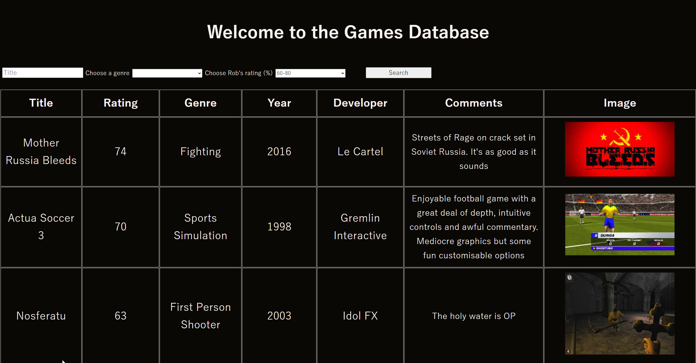

# Robert Jones Game Rating App

This app is to keep track of all the games I've played, and what I thought of then. You can search for games by different parameters and add in new ones. I originally made this project over Christmas in Vanilla JavaScript and am now refactoring the frontend into TypeScript and React.

## Screenshots

## FAQ

#### Why can't I search by multiple parameters?

I may choose to add this in, but due to the number of games in the database not being that high yet I feel that the search function is currently best served by operating individually for each parameter.

#### Why do I have to add by your specified genres, rather than add my own one in?

This is just for consistency. It should be a fairly comprehensive list of genres but you can get in touch if you think I'm missing anything.

## Authors

[Robert Jones](https://github.com/RobertHJones)

## 🚀 About Me

I'm training as a full stack developer on the School of Code bootcamp.

## Support

For support, email roberthuwjones@outlook.com
